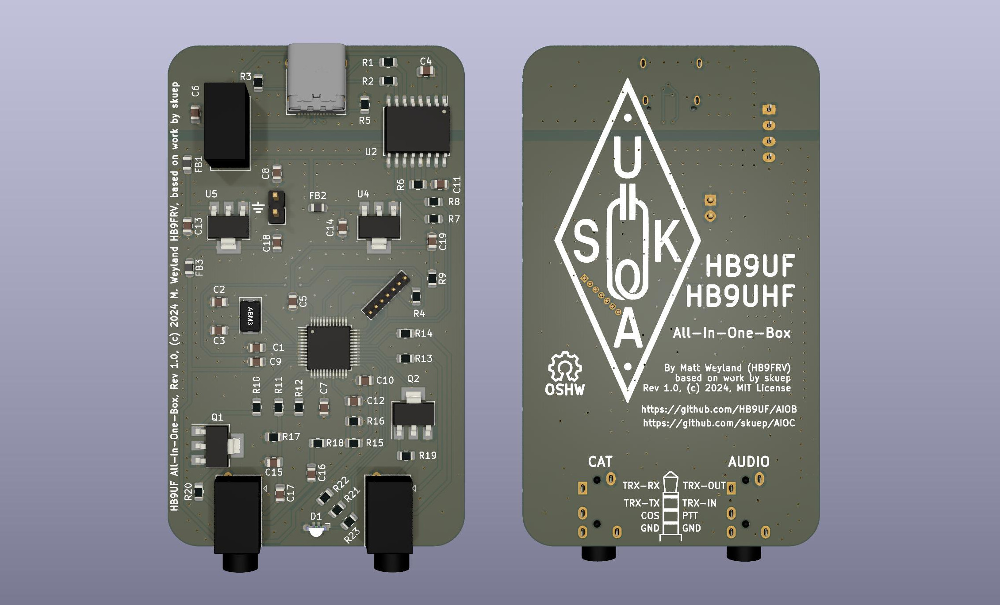

[](https://github.com/HB9UF/AIOB/releases)
[](https://github.com/HB9UF/AIOB/blob/master/LICENSE.md)

# AIOB
This is the Ham Radio *All-in-one-Box*. It is a fork of the [AIOC](https://github.com/skuep/AIOC) project by [skuep](https://github.com/skuep). AIOC is a small adapter designed to plug directly into a radio, offering a sound-card and a serial interface ("COM port") via its USB-C interface (see below). AIOC developed in this fork differs from AIOC in a number of ways:

- The PCB was redesigned to fit in a small extruded [aluminum box](https://de.aliexpress.com/item/1005002758276938.html?algo_exp_id=265cb891-2734-45df-9939-85fcaf4d986a-10) instead of an overmolded enclosure. This renders it compatible to radios that lack the Kenwood-style connector that is integral to the AIOC design.
- The wiring between AIOB and the radio is implemented using cables with TRRS connectors instead of the aforementioned solution.
- Having a larger box at disposal allowed us to increase the size of the passive components to 0805. This way, we can also use this project as intermediate level SMD practising kit. The layout has been implemented with this in mind. In consequence, electrically better part placement would be possible in some cases but we focused on ease of assembly at the expense of this.
- Since [some claims exist](https://www.swiss-artg.ch/index.php?id=61&tx_news_pi1%5Bnews%5D=309&tx_news_pi1%5Bcontroller%5D=News&tx_news_pi1%5Baction%5D=detail&cHash=2c1ab05b8925a4b1715bc4929fcc3d95) that devices of this kind would perform better when galvanically isolated, we added an isolated 5 V DC/DC converter along with a [Analog Devices ADuM 3160](https://www.analog.com/en/products/adum3160.html) to test this hypothesis.
- Extra circuitry was added to sense the radio sqleuch (COS/TOS).
- While the AIOC can support Dual-PTT HTs, this feature is missing from the AIOB.

In addition to the intended applications of AIOC, we hope to use AIOB as EchoLink interface.

**Note that AIOC is currently still being tested! Our AIOB fork is even more bleeding edge, we are in the process of assembling the first PCB revision.** Please read this README carefully before ordering anything.



## Features ##
- Cheap & Hackable Digital mode USB interface (similar to digirig, mobilinkd, etc...)
- Programming Cable Function via virtual Serial Port
- Compact form-factor (DIY overmolded enclosure is currently TBD)
- Based on easy-to-hack **STM32F302** with internal ADC/DAC (Programmable via USB bootloader using [DFU](#how-to-program))

## Compatibility
### Software
  - [Direwolf](#notes-on-direwolf) as AX.25 modem/APRS en+decoder/...
  - [APRSdroid](#notes-on-aprsdroid) as APRS en+decoder
  - [CHIRP](#notes-on-chirp) for programming
  - ... and more

### Tested Radios (so far)
  - Wouxun UV-9D Mate (CHIRP + APRS)
  - Baofeng UV-5R (CHIRP + APRS)
  - BTECH 6X2 (CHIRP) 

## Ordering and Assembly

*TODO*

## How To Build
For building the firmware, clone the repository and initialize the submodules. Create an empty workspace with the STM32CubeIDE and import the project.
  - ``git clone <repositry url>``
  - ``git submodule update --init``
  - Start STM32CubeIDE and create a new workspace under ``<project-root>/stm32``
  - Choose File->Import and import the ``aioc-fw`` project in the same folder without copying
  - Select Project->Build All and the project should build. Use the Release build unless you specifically want to debug an issue

## How To Program
### Initial programming
The following steps are required for initial programming of the AIOB:
- Short outermost pins on the programming header. This will set the device into bootloader mode in the next step.
- Connect USB-C cable to the AIOB PCB
- Use a tool like ``dfu-util`` to program the firmware binary from the GitHub Releases page like this:
  ````
  dfu-util -a 0 -s 0x08000000 -D aioc-fw-x-y-z.bin
  ````
  __Note__ that a ``libusb`` driver is required for this. On Windows there are additional steps required as shown [here](https://yeswolf.github.io/dfu) (*DFuSe Utility and dfu-util*). On other operating systems (e.g. Linux, MacOS), this just works ™ (provided libusb is installed on your system).
  On Linux (and MacOS), your user either needs to have the permission to use libusb (``plugdev`` group) or you might need to use ``sudo``.
- Remove short from first step, unplug and replug the device, it should now enumerate as the AIOB device

### Firmware updating
Once the AIOB has firmware loaded onto it, it can be re-programmed without the above BOOT sequence by following these steps.

__Note__ This requires firmware version >= 1.2.0. For older firmwares, the initial programming sequence above is required for updating the firmware.
- Run ``dfu-util`` like this
  ````
  dfu-util -d 1209:7388 -a 0 -s 0x08000000:leave -D aioc-fw-x-y-z.bin
  ````

This will reboot the AIOB into the bootloader automatically and perform the programming. 
After that, it automatically reboots the AIOB into the newly programmed firmware.

__Note__ Should you find yourself with a bricked AIOB, use the initial programming sequence above

## How To Use
The serial interface of the AIOB enumerates as a regular COM (Windows) or ttyACM port (Linux) and can be used as such for programming the radio as well as PTT (Asserted on ``DTR=1`` and ``RTS=0``).

__Note__ before firmware version 1.2.0 of the original project, PTT was asserted by ``DTR=1`` (ignoring RTS) which caused problems with certain radios when using the serial port for programming the radio e.g. using CHIRP.

The soundcard interface of the AIOB gives access to the audio data channels. It has one mono microphone channel and one mono speaker channel and currently supports the following baudrates:
  - 48000 Hz (preferred)
  - 32000 Hz
  - 24000 Hz
  - 22050 Hz (specifically for APRSdroid, has approx. 90 ppm of frequency error)
  - 16000 Hz
  - 12000 Hz
  - 11025 Hz (has approx. 90 ppm of frequency error)
  - 8000 Hz

Since firmware version 1.2.0, a CM108 style PTT interface is available for public testing. This interface works in parallel to the COM-port PTT.
Direwolf on Linux is confirmed working, please report any issues. Note that currently, Direwolf reports some warnings when using the CM108 PTT interface on the AIOB. 
While they are annoying, they are safe to ignore and require changes in the upstream direwolf sourcecode. See https://github.com/wb2osz/direwolf/issues/448 for more details.

Please refer to the README file of the original project for detailed usage notes.
